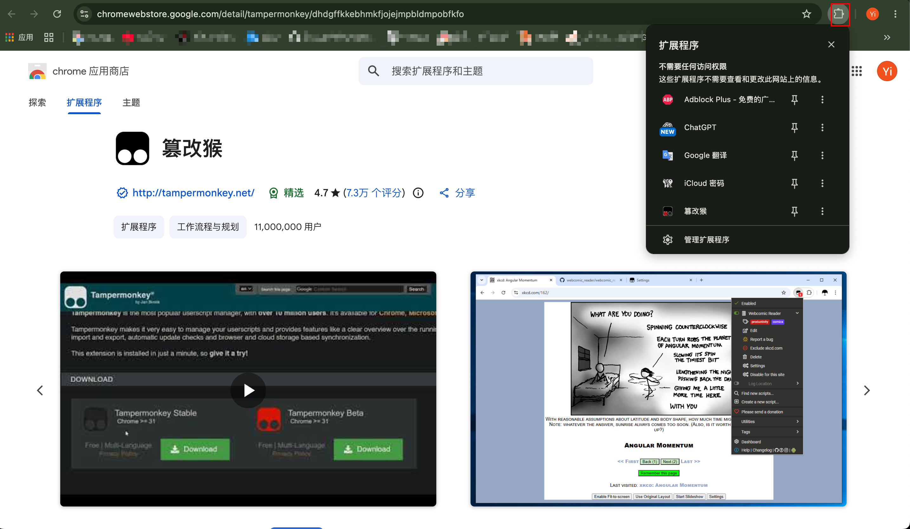
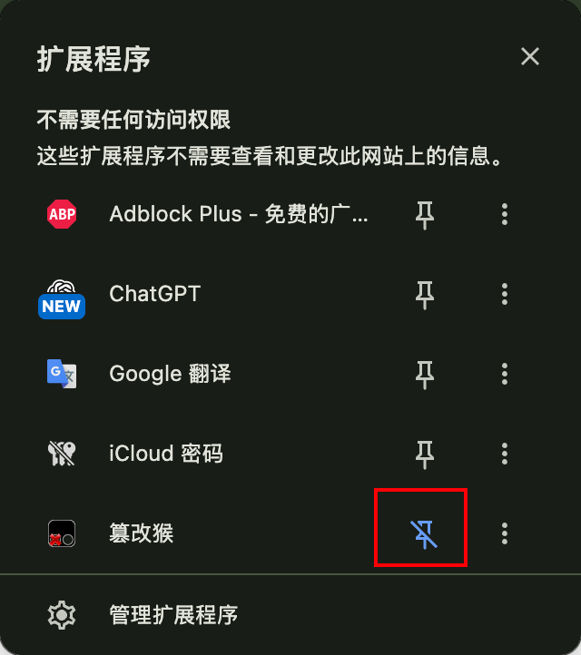
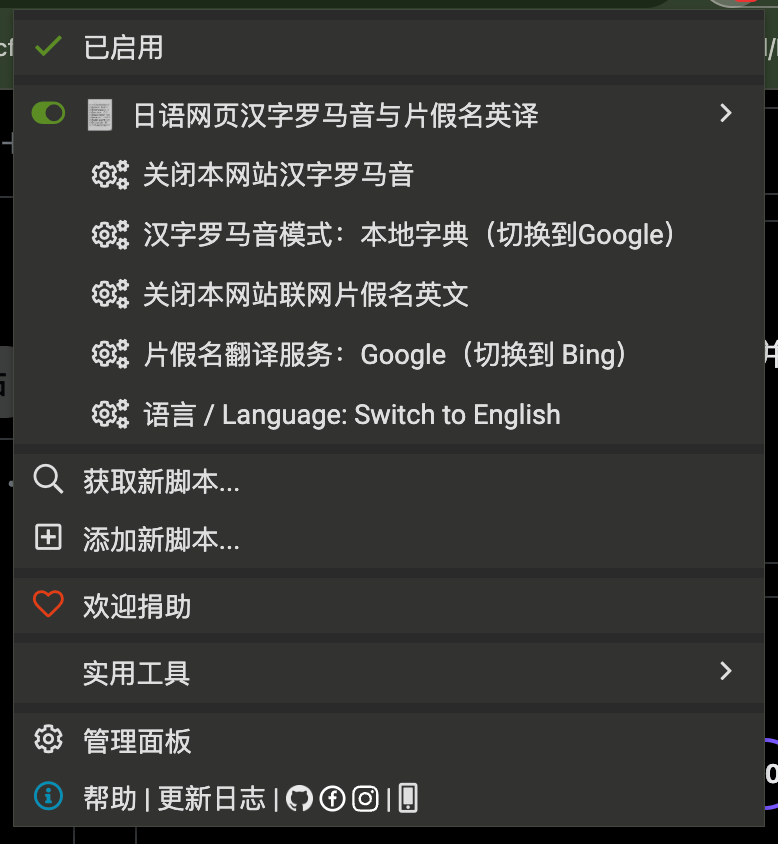
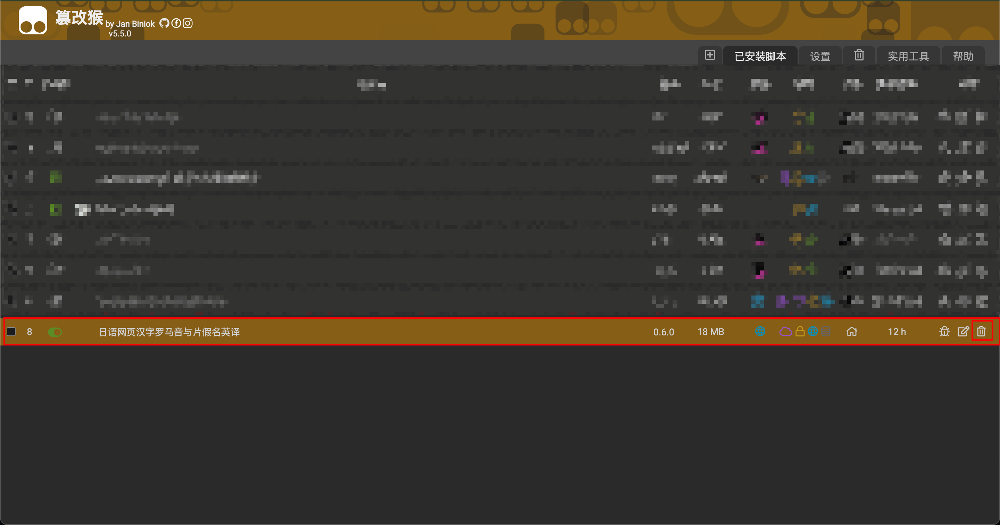

# 日语阅读助手安装与使用指南

项目原名 **YomiRuby**，现名 **日语阅读助手 / Japanese Reading Helper**。本指南的固定安装链接和截图仍对应旧版，安装页与菜单可能显示 YomiRuby；0.6.2 使用上述新名称。

这份指南写给第一次使用浏览器用户脚本的人。跟着下面的步骤操作，即可在日语网页的汉字上方显示罗马音，并按需在片假名词组上方显示英文。

> **先记住一件事：**日语阅读助手安装完成后，默认不会立刻修改网页。你需要在每个想使用的网站上，手动点击一次“开启本网站汉字罗马音”或“开启本网站联网片假名英文”。

## 最短操作路线

如果你只想先把汉字罗马音用起来，完成下面四步即可：

1. 在桌面版 Chrome 中安装 Tampermonkey：[Chrome 应用商店中的 Tampermonkey 官方页面](https://chromewebstore.google.com/detail/tampermonkey/dhdgffkkebhmkfjojejmpbldmpobfkfo)；
2. 打开 [日语阅读助手国内优先安装链接](https://cdn.jsdelivr.net/gh/ywu73/japanese-reading-helper@c4f5660bf7e632351b9e3a329e8dd13316584784/dist/yomi-ruby.user.js)，在 Tampermonkey 页面点击“安装”；
3. 打开一个日语网页并刷新，点击浏览器右上角的 Tampermonkey 图标；
4. 在日语阅读助手菜单中点击“开启本网站汉字罗马音”。

想选择本地字典、Bing 或 Google，或者开启片假名英文时，再继续阅读后面的详细说明。

## 一、使用前准备

当前兼容目标是 **桌面版 Google Chrome + Tampermonkey（篡改猴，很多用户也习惯称为“油猴”）**。其他浏览器虽然也可能安装 Tampermonkey，但日语阅读助手尚未完成相应的兼容验证；如需尝试，请使用文末第十二节列出的官方入口，并自行确认实际效果。

安装过程分为两步：

1. 安装 Tampermonkey 浏览器扩展；
2. 通过 Tampermonkey 安装日语阅读助手用户脚本。

为避免安装到仿冒或被修改的扩展，建议直接打开 [Chrome 应用商店中的 Tampermonkey 官方页面](https://chromewebstore.google.com/detail/tampermonkey/dhdgffkkebhmkfjojejmpbldmpobfkfo)，或从 [Tampermonkey 官方网站](https://www.tampermonkey.net/index.php?browser=chrome&locale=zh) 进入安装页面。不要从不明网盘、论坛附件或第三方“破解版”安装。

## 二、安装 Tampermonkey（篡改猴）

1. 打开 [Chrome 应用商店中的 Tampermonkey 官方页面](https://chromewebstore.google.com/detail/tampermonkey/dhdgffkkebhmkfjojejmpbldmpobfkfo)。

   

   如果页面显示“从 Chrome 中移除”，说明当前浏览器已经安装 Tampermonkey，可以直接继续安装日语阅读助手；第一次安装时，这里应显示“添加至 Chrome”。

2. 点击“添加至 Chrome”。
3. Chrome 弹出确认窗口后，点击“添加扩展程序”。
4. 安装完成后，点击浏览器右上角的“扩展程序”拼图图标。

   

5. 找到 Tampermonkey，点击旁边的图钉，把它固定在工具栏上，方便以后开关日语阅读助手。

   

## 三、安装日语阅读助手

### 方式 A：国内网络优先尝试 jsDelivr 固定版本

先确认 Tampermonkey 已经安装并启用，然后在 Chrome 中直接打开下面的链接：

<https://cdn.jsdelivr.net/gh/ywu73/japanese-reading-helper@c4f5660bf7e632351b9e3a329e8dd13316584784/dist/yomi-ruby.user.js>

这是固定在提交 `c4f5660bf7e632351b9e3a329e8dd13316584784` 的旧版 YomiRuby **0.6.0** 安装文件。固定提交可以避免分享链接指向的文件内容随 `main` 分支变化。

打开链接后：

1. Tampermonkey 应自动显示用户脚本安装页面；
2. 确认页面上的脚本名称是 **YomiRuby**，版本是 **0.6.0**；
3. 点击“安装”；
4. 安装完成后，打开 Tampermonkey 管理面板，确认日语阅读助手已存在并处于启用状态。

> **截图待补：**Tampermonkey 的旧版 YomiRuby 0.6.0 安装确认页，建议同时展示脚本名称、版本号和“安装”按钮。

### 方式 B：可以访问 Greasy Fork 时使用油猴脚本发布页

也可以打开日语阅读助手的 Greasy Fork 页面：

<https://greasyfork.org/zh-CN/scripts/589223>

进入页面后点击“安装此脚本”，再在 Tampermonkey 的确认页点击“安装”。Greasy Fork 页面可以查看公开版本和更新信息；页面能否打开、安装和更新能否完成，仍取决于当时的网络环境。

> **网络说明：**jsDelivr 链接通常更便于国内用户获取日语阅读助手脚本文件，但它不代表整个安装和运行过程已经验证为“中国大陆网络必定可用”。日语阅读助手安装或更新时还需要获取固定版本的本地词典资源；使用联网模式时还会访问所选的 Bing 或 Google 服务。任何一处都可能受网络环境影响。

## 四、功能一：开启汉字罗马音

### 1. 打开一个日语网页

安装完成后，打开或刷新一个包含日语正文的普通 `http://` 或 `https://` 网页。

日语阅读助手不会在 Chrome 设置页、扩展程序页、新标签页等浏览器内部页面运行。在表单、编辑框、代码块、隐藏内容和部分网站自定义组件中，它也会主动跳过文字，避免破坏网页功能。

### 2. 打开日语阅读助手菜单

1. 点击浏览器右上角的 Tampermonkey 图标；
2. 在当前网页的 Tampermonkey 弹窗中找到日语阅读助手；
3. 找到日语阅读助手提供的操作菜单。

正常情况下，简体中文界面会看到下面五类菜单，并按这个顺序排列：

| 菜单 | 作用 | 设置范围 |
|---|---|---|
| 开启/关闭本网站汉字罗马音 | 控制汉字上方的罗马音 | 只对当前网站生效 |
| 汉字罗马音模式 | 在 Bing、本地字典、Google 之间切换 | 对所有网站生效 |
| 开启/关闭本网站联网片假名英文 | 控制片假名词组上方的英文 | 只对当前网站生效 |
| 片假名翻译服务 | 在 Bing 与 Google 之间切换 | 对所有网站生效 |
| 语言 / Language | 切换菜单语言 | 对所有网站生效 |



### 3. 选择汉字罗马音模式

点击“汉字罗马音模式”可以循环切换三种模式。菜单文字在冒号后、括号前显示**当前模式**，括号里显示**点击后将切换到的模式**。

例如：

```text
汉字罗马音模式：Bing（切换到本地字典）
```

这表示当前正在使用 Bing；点击一次后，当前模式会变成本地字典。请继续点击，直到你想使用的模式出现在括号前面。

| 模式 | 特点 | 适合情况 |
|---|---|---|
| **本地字典** | 在浏览器本地分析含汉字词，不把页面文字发送给翻译服务；首次启动可能需要稍等 | 优先考虑隐私和稳定边界时，建议先用此模式；另外此模式响应速度快，建议选择 |
| **Bing** | 把去重后的完整含汉字词发送给 Bing，使用服务返回的日语转写 | 国内网络环境下可以优先尝试，但不保证始终可用或准确 |
| **Google** | 把去重后的完整含汉字词发送给 Google，使用服务返回的日语罗马化 | 可以正常访问 Google 服务时尝试，不保证始终可用或准确 |

联网模式不会发送完整句子、周围上下文、页面标题、页面网址或浏览历史；但被处理的完整词本身会发送给你选择的服务。某个服务失败后，日语阅读助手不会偷偷改用另一服务。

### 4. 开启当前网站

点击“**开启本网站汉字罗马音**”。等待片刻后，网页中符合条件的含汉字词上方应出现罗马音。

如果菜单已经显示“关闭本网站汉字罗马音”，说明当前网站已经开启，不需要再点一次。


## 五、功能二：开启片假名英文

片假名英文是独立的联网功能，不会因为开启汉字罗马音而自动开启。

1. 点击“片假名翻译服务”，选择 Bing 或 Google；它同样在冒号后、括号前显示当前服务，括号里显示点击后将切换到的服务；
2. 国内网络环境可以先尝试 Bing；能够正常访问 Google 服务时也可以选择 Google；
3. 点击“开启本网站联网片假名英文”；
4. 等待网页中的匹配片假名词组上方出现英文。

片假名功能一定会把匹配到的片假名词组发送给所选服务。结果属于尽力而为，不保证每个片假名都有英文，也不保证翻译或词源完全准确。服务失败时会保留原文，不会自动把同一个词组转发给另一家服务。


## 六、在其他网站使用

“本网站”指当前网页所属的精确网站来源。你在一个网站上开启日语阅读助手，不会自动在另一个网站上开启。

因此，第一次访问另一个日语网站时，需要再次打开 Tampermonkey 菜单，并分别点击：

- “开启本网站汉字罗马音”；
- 如有需要，再点击“开启本网站联网片假名英文”。

汉字模式、片假名翻译服务和界面语言是全局设置，切换后会用于所有已经开启对应功能的网站。

## 七、关闭、暂停或卸载

### 只关闭当前网站

打开 Tampermonkey 菜单，点击：

- “关闭本网站汉字罗马音”；
- “关闭本网站联网片假名英文”。

关闭后，日语阅读助手会停止对应任务，并尽力把自己添加的标注恢复为原文。两个功能互相独立，可以只开一个、只关一个。

### 暂停整个脚本

在 Tampermonkey 管理面板中关闭日语阅读助手的启用开关。重新启用后，之前保存的网站开关和模式仍可能继续生效。

### 完全卸载

在 Tampermonkey 管理面板中找到日语阅读助手，点击删除。删除前请确认选择的是日语阅读助手，不要误删其他用户脚本。



## 八、常见问题

### 安装成功了，但网页没有任何变化

这是最常见的情况。日语阅读助手对每个新网站都默认关闭。请刷新日语网页，然后打开 Tampermonkey 菜单，点击“开启本网站汉字罗马音”。

### 换了一个网站后又没有效果

网站开关不是全局开关。请在新网站上再次点击“开启本网站汉字罗马音”；片假名功能也需要单独开启。

### 菜单显示英文

点击：

```text
语言 / Language: 切换到简体中文
```

语言只改变菜单和错误提示，不会自动开启功能，也不会改变已经选择的模式或服务。

### 找不到日语阅读助手菜单

依次检查：

1. Tampermonkey 扩展是否已启用；
2. Tampermonkey 管理面板中的日语阅读助手是否已启用；
3. 当前是否为普通 `http://` 或 `https://` 网页，而不是 Chrome 内部页面；
4. 安装后是否刷新过当前网页；
5. 页面是否在无痕窗口中；如果是，需要先在 Chrome 扩展设置中明确允许 Tampermonkey 在无痕模式下运行。

### 只显示部分词，或者有些地方不显示

日语阅读助手只处理它能安全识别的正文。表单、编辑区、代码块、隐藏内容、已有 Ruby 标注和部分复杂网页组件会被跳过。读音或翻译结果不可靠时，它也会保留原文，而不是猜测。

### 本地字典第一次开启比较慢

本地模式需要在当前页面初始化日语词典。首次开启可能比后续处理慢，请保持标签页在前台并稍等。若一直没有结果，请确认安装或更新时所需的固定词典资源没有被网络、代理或安全软件阻止。

### Bing 或 Google 模式没有结果

联网服务可能暂时不可达、限流、修改响应格式，或无法给出可靠结果。可以手动切换模式或服务后重试；日语阅读助手不会在失败后自动切换到另一家服务。

### 点击 jsDelivr 链接后只看到一大页代码

通常表示 Tampermonkey 没有安装、没有启用，或者浏览器没有把 `.user.js` 链接交给 Tampermonkey。请先完成“安装 Tampermonkey”部分，确认扩展已启用，然后重新打开 jsDelivr 链接。

## 九、版本与更新说明

本指南中的 jsDelivr 链接固定指向旧版 YomiRuby **0.6.0**，因此这个分享地址本身不会随着仓库后续提交改变。

该 0.6.0 文件内部的自动更新地址仍指向 GitHub Raw 的 `main` 构建文件。自动更新能否完成取决于 Tampermonkey 设置和网络是否能够访问该地址；更新失败不会自动删除已经安装的版本。希望先了解新版本内容时，可以查看 [Greasy Fork 发布页](https://greasyfork.org/zh-CN/scripts/589223) 或 [日语阅读助手 GitHub 仓库](https://github.com/ywu73/japanese-reading-helper)。

## 十、隐私提示

- **本地字典模式：**页面文字在浏览器本地分析，不发送给 Bing 或 Google。
- **Bing/Google 汉字模式：**只发送去重后的完整含汉字词，不发送整句和周围上下文。
- **联网片假名英文：**只发送匹配到的片假名词组。
- 日语阅读助手不包含项目自有遥测、广告、跟踪标识、崩溃上报或远程日志。
- 联网服务属于外部、未文档化的网页接口，不保证长期可用、准确或在中国大陆始终可达。

更完整的技术与隐私边界见 [安全与隐私边界](security-boundary.md) 和 [网络审计](network-audit.md)。

## 十一、反馈问题
如果在hero老师群可以直接@我 腐竹

普通使用问题和功能缺陷可以提交到 [GitHub Issues](https://github.com/ywu73/japanese-reading-helper/issues)。提交前请尽量提供：

- Chrome 版本；
- Tampermonkey 版本；
- 日语阅读助手版本；
- 使用的网站与页面类型；
- 当前选择的汉字模式或片假名翻译服务；
- 可公开的错误提示或截图。

请先遮挡截图中的账号、邮箱、聊天内容和其他个人信息。安全或隐私漏洞不要发布到公开 Issue，应使用 GitHub Private Vulnerability Reporting。

## 十二、常见浏览器的 Tampermonkey（篡改猴）安装链接

下面的链接均来自 **Tampermonkey 官方网站或对应浏览器的官方扩展商店**。请优先安装正式版，不要从不明网盘、论坛附件或第三方下载站获取扩展安装包。

> **兼容性说明：**这些链接只说明相应浏览器存在 Tampermonkey 安装入口，不代表日语阅读助手已在所有浏览器中验证通过。日语阅读助手当前的兼容目标仍然只有 **桌面版 Google Chrome + Tampermonkey**；Edge、Firefox、Safari、Opera 和移动端均属于未经完整验证的自行尝试范围。

| 浏览器 | Tampermonkey 官方说明页 | 官方扩展商店入口 | 日语阅读助手当前状态 |
|---|---|---|---|
| **Google Chrome** | [Chrome 版官方说明](https://www.tampermonkey.net/index.php?browser=chrome&locale=zh) | [Chrome 应用商店正式版](https://chromewebstore.google.com/detail/dhdgffkkebhmkfjojejmpbldmpobfkfo) | **当前兼容目标** |
| **Microsoft Edge** | [Edge 版官方说明](https://www.tampermonkey.net/index.php?browser=edge&locale=zh) | [Microsoft Edge 加载项正式版](https://microsoftedge.microsoft.com/addons/detail/iikmkjmpaadaobahmlepeloendndfphd) | 未完成日语阅读助手兼容验证 |
| **Mozilla Firefox** | [Firefox 版官方说明](https://www.tampermonkey.net/index.php?browser=firefox&locale=zh) | [Firefox Add-ons 正式版](https://addons.mozilla.org/firefox/addon/tampermonkey/) | 未完成日语阅读助手兼容验证 |
| **Safari** | [Safari 版官方说明](https://www.tampermonkey.net/index.php?browser=safari&locale=zh) | [Apple App Store 当前版](https://apps.apple.com/app/tampermonkey/id6738342400) | 商店可用性可能因地区而异；未完成日语阅读助手兼容验证，包括 macOS 与移动端 |
| **Opera** | [Opera 版官方说明](https://www.tampermonkey.net/index.php?browser=opera&locale=zh) | [Opera Add-ons 上的 Tampermonkey Beta](https://addons.opera.com/en/extensions/details/tampermonkey-beta/) | 官方入口当前标为 Beta；未完成日语阅读助手兼容验证 |

如果表格中的商店入口失效，应先回到对应的 Tampermonkey 官方说明页查找最新入口，而不是转向来源不明的镜像。浏览器扩展安装完成后，后续的日语阅读助手安装和使用步骤仍与本指南前文一致。
